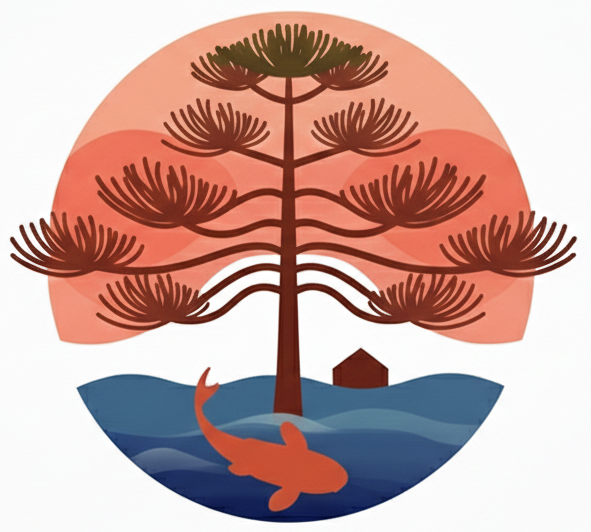
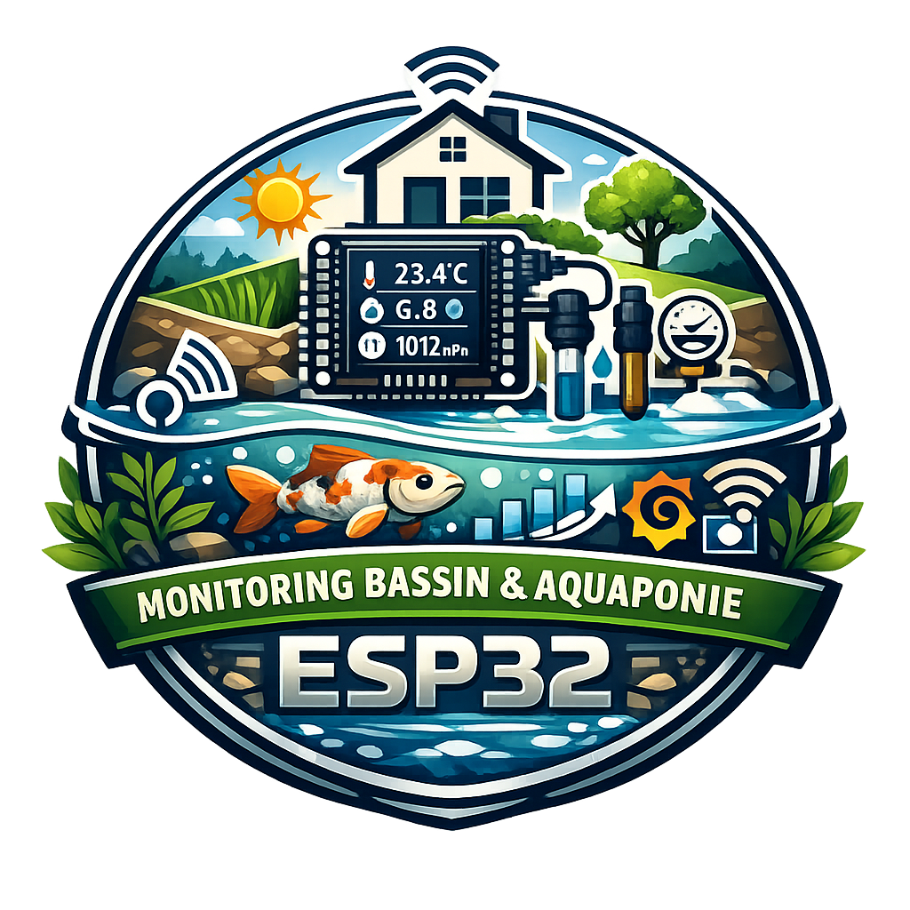
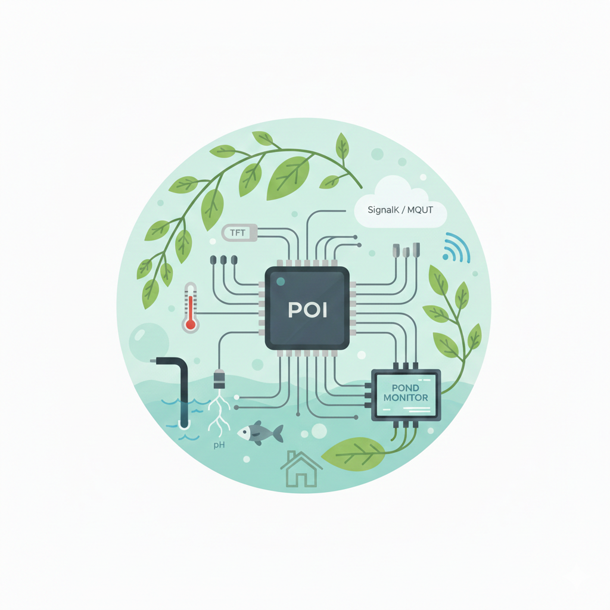
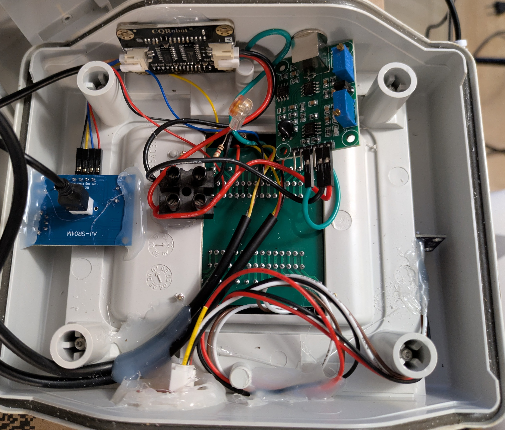
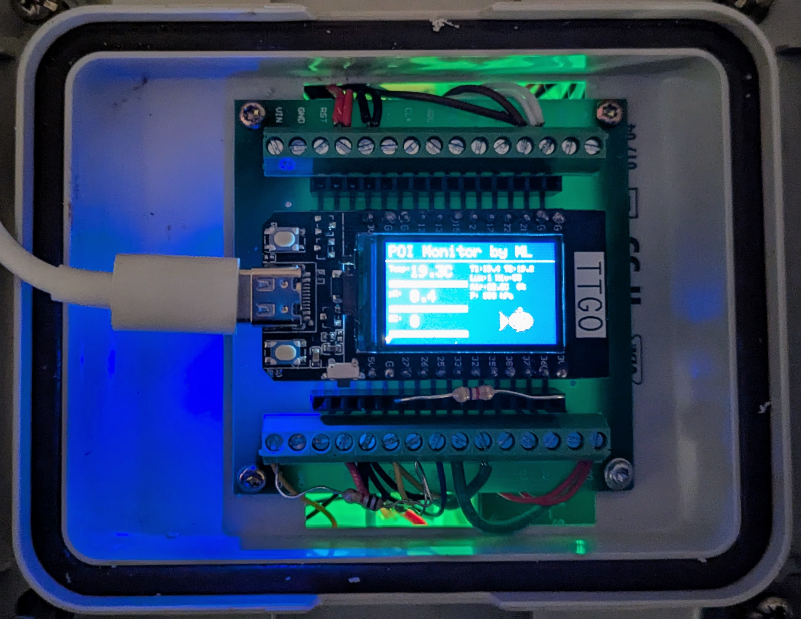
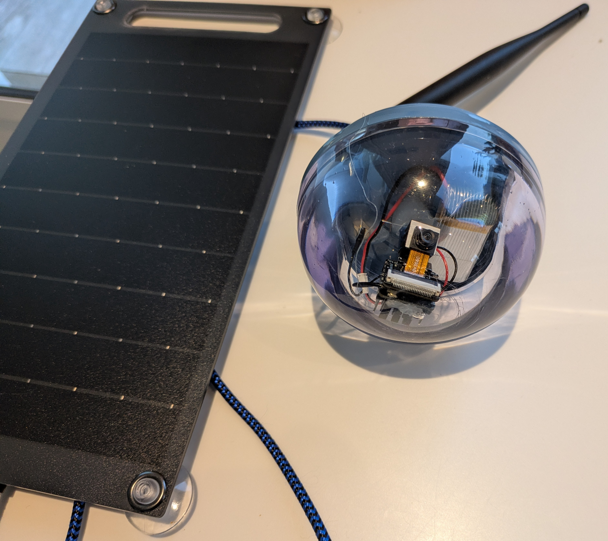

[](https://opensource.org/licenses/Apache-2.0)
[](https://signalk.org/)
[](https://www.espressif.com/)

🌍 *[Français](README.fr.md)*



# SignalK ESP32 Pond Sensor

ESP32-based outdoor pond / aquaponics monitoring system with local TFT display and SignalK publishing via MQTT.



This project contains three sub-projects:

- **signalk_esp_pond_sensor/** — Main ESP32 firmware for sensors (Arduino C++)
- **signalk_esp_pond_video/** — ESP32-CAM firmware for video streaming (Arduino C++)
- **signalk-poi-lab/** — SignalK monitoring webapp (Next.js)

## Architecture



```text
[ Water & air sensors ]
        |
        | (Analog / I2C / 1-Wire)
        v
    ESP32 (TTGO T-Display)
        |
        |-- SPI  -> TFT screen 135x240 (ST7789)
        |-- WiFi -> MQTT -> SignalK Server
        |                       |
        |                       v
        |                  signalk-poi-lab (webapp)
        |-- Standby 20h-7h (screen off)
        '-- Watchdog 30s
```

## Hardware & Sensors


*Main sensor module with TTGO T-Display*


*Sensor wiring and enclosure details*


*ESP32-CAM module for live pond monitoring*

| Sensor | Measurement | Interface |
|--------|-------------|-----------|
| DS18B20 x2 | Water temperature | 1-Wire (GPIO 27) |
| pH probe | pH | Analog (GPIO 33) |
| EC probe | Conductivity | Analog (GPIO 32) |
| HC-SR04 | Water level | GPIO 25/26 |
| BH1750 | Illuminance (lux) | I2C |
| BME280/BMP280 | Air temperature, humidity, pressure | I2C |
| ESP32-CAM | Live video feed | WiFi (HTTP Stream) |

## SignalK Paths

| Measurement | Path |
|-------------|------|
| Water temperature (avg) | `tanks.liveWell.pond.temperature` |
| Temperature probe 1 | `tanks.liveWell.pond1.temperature` |
| Temperature probe 2 | `tanks.liveWell.pond2.temperature` |
| pH | `tanks.liveWell.pond.ph` |
| Conductivity | `tanks.liveWell.pond.conductivity` |
| Water level | `tanks.liveWell.pond.currentLevel` |
| Illuminance | `environment.inside.pond.illuminance` |
| Air temperature | `environment.inside.pond.temperature` |
| Air humidity | `environment.outside.relativeHumidity` |
| Pressure | `environment.inside.pond.pressure` |

## Firmware Setup

### Main Sensor Configuration

```bash
cp signalk_esp_pond_sensor/config.h.sample signalk_esp_pond_sensor/config.h
```

Edit `config.h` with your WiFi credentials and MQTT broker address:

```c
#define WIFI_SSID     "MY_WIFI"
#define WIFI_PASS     "MY_PASSWORD"
#define MQTT_HOST     "192.168.x.x"
#define MQTT_PORT     1883
#define DEVICE_NAME   "signalk-esp-pond-sensor-01"
```

`config.h` is gitignored (contains secrets).

### Camera Configuration

```bash
cp signalk_esp_pond_video/config.h.sample signalk_esp_pond_video/config.h
```

Edit the camera `config.h` similarly.

### Arduino Dependencies (Main Sensor)

- WiFi (ESP32 core)
- PubSubClient
- Adafruit GFX + Adafruit ST7789
- OneWire + DallasTemperature
- BH1750
- Adafruit BME280 / BMP280

### Upload

Flash via Arduino IDE or PlatformIO on an ESP32 (TTGO T-Display recommended for main sensor, ESP32-CAM module for video).

## POI Laboratory Webapp

See [signalk-poi-lab/README.md](signalk-poi-lab/README.md).

## License

Apache-2.0